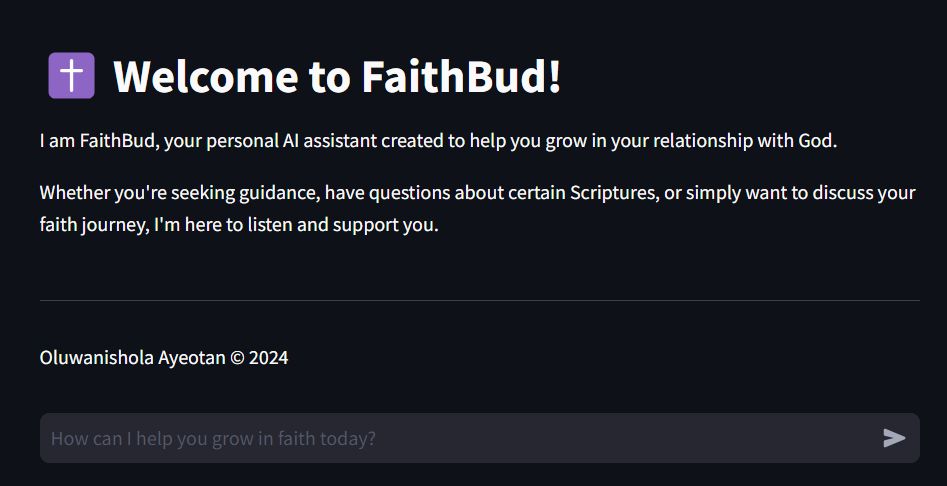

# ✝️ FaithBud

Welcome to **FaithBot**, an interactive AI assistant designed to help people grow in their relationship with God. 

It was built using OpenAI's GPT-3.5 and Streamlit. 

## Features

- **Interactive Chat Interface**: Users can engage in real-time conversations with the chatbot.
- **User-Friendly Design**: Built with Streamlit for excellent user experience.

## Live Demo

You can try out the live demo here: [Open FaithBud](https://faithbud.streamlit.app/)

[](https://faithbud.streamlit.app/)


### Installation

1. Install the requirements

   ```
   $ pip install -r requirements.txt
   ```

2. Run the app

   ```
   $ streamlit run streamlit_app.py
   ```

Here’s a glimpse of the bot interface:

 